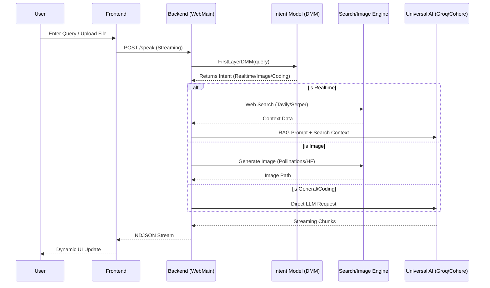

# 🌌 Thing AI — The Advanced Intelligence Orchestrator

Thing AI is a premium, high-performance AI ecosystem designed for seamless real-time interaction, advanced web intelligence, and professional content orchestration. It combines a state-of-the-art "Cinema Gloss" interface with a multi-layered backend architecture to deliver lightning-fast, context-aware responses.


## ✨ Highlighting Features

Thing AI is more than just a chatbot; it's a complete AI-driven workstation designed for the modern web.

*   **🎙️ Voice Orchestration (Speech & Voice)**: 
    Experience a truly interactive assistant. Thing AI features integrated **Speech-to-Text (STT)** and **Text-to-Speech (TTS)** capabilities, allowing it to listen to your commands and respond vocally with natural-sounding voices.
*   **🌍 Real-Time Intelligence**: 
    Never be limited by training data cutoffs. Using a high-precision RAG pipeline, Thing AI fetches live data from **Serper**, **Tavily**, and **Google News RSS** to provide up-to-the-minute answers on news, stocks, weather, and more.
*   **💻 Integrated Multi-File IDE**: 
    A professional-grade coding workspace powered by the **Monaco Editor**. 
    *   **AI-Driven Coding**: The assistant can directly inject or replace code in your editor using specialized protocols.
    *   **Multi-Language Support**: Seamlessly manage multiple files (HTML, CSS, JS, Python, etc.) within a unified project structure.
    *   **Live Sandbox**: Execute and preview your code instantly in a secure environment.
*   **📱 Advanced Session Management**: 
    Keep your workflow consistent across all your devices. Powered by **Clerk Authentication**, Thing AI manages persistent chat histories and workspace states, ensuring you can pick up exactly where you left off.

---

## 🏗 System Architecture

Thing AI follows a decoupled architecture where a high-energy frontend communicates with a sophisticated Python-based orchestration layer.

### 🧩 Core Components

1.  **Frontend Interface (The Cinema Layer)**:
    *   Built with **Vanilla JS** and **Dynamic CSS** for maximum performance and zero dependency overhead.
    *   Implements a custom **streaming parser** for real-time NDJSON responses.
    *   Features a PWA-ready architecture with Service Workers for offline-first capabilities.

2.  **Orchestration Backend (The Brain)**:
    *   **Flask Web Server**: Manages session state, streaming responses, and endpoint routing.
    *   **Intent Classifier (FirstLayerDMM)**: A specialized Cohere/Groq-powered model that routes queries to specific engines (Realtime, Image, General, or Coding).
    *   **Universal AI Wrapper**: A robust fallback system that intelligently switches between Groq (70B/8B) and Cohere to ensure 100% uptime.

3.  **Intelligence Engines**:
    *   **Real-time Search Engine**: A multi-source aggregator (Tavily, Serper, Google News RSS, DuckDuckGo) that feeds live data into a RAG pipeline.
    *   **Image Synthesis Engine**: Parallel processing across Pollinations AI and HuggingFace models (Flux, Stable Diffusion XL).
    *   **Document Processor**: Extraction and contextual analysis for PDF, Docx, and TXT files.

---

## 🔄 Execution Workflow

The following diagram illustrates how a user request flows through the Thing AI ecosystem:



---

## 🛠 Technology Stack

### **Frontend**
*   **Structure**: Semantic HTML5 & SVG components.
*   **Aesthetics**: Vanilla CSS3 with Custom Properties (CSS Variables) for high-fidelity dark/light mode transitions.
*   **Logic**: Asynchronous JavaScript (ES6+) with NDJSON streaming.
*   **Editor**: Integrated Monaco-inspired code editor for programming tasks.

### **Backend**
*   **Framework**: Flask (Python 3.10+) with `stream_with_context`.
*   **AI Models**: 
    *   **Groq**: Llama 3.3 70B (Primary), Llama 3.1 8B (Fallback).
    *   **Cohere**: Command R+ for advanced intent classification.
    *   **DeepSeek**: Specialized coding models for high-precision logic.
*   **Search**: Tavily, Serper, DuckDuckGo, Google News RSS.
*   **Image Gen**: Pollinations.ai API, HuggingFace Inference.

---

## 🚀 Installation & Setup

### **1. Prerequisites**
*   Python 3.10 or higher.
*   Virtual environment manager (`venv`).

### **2. Setup Environment**
```bash
# Clone the repository
git clone https://github.com/yourusername/thing-ai.git
cd thing-ai

# Create and activate virtual environment
python -m venv .venv
source .venv/bin/activate  # Windows: .venv\Scripts\activate

# Install dependencies
pip install -r requirements.txt
```

### **3. Configuration**
Create a `.env` file in the root directory and add your keys (never share these!):
```env
# AI Models
GroqAPIKey=your_groq_key
CohereAPIKey=your_cohere_key
HuggingFaceAPIKey=your_hf_key

# Search Engines
SERPER_API_KEY=your_serper_key
TAVILY_API_KEY=your_tavily_key

# UI Settings
Username=YourName
Assistantname=Thing AI
```

### **4. Run Application**
```bash
python WebMain.py
```
Visit `http://localhost:8000` to experience Thing AI.

---

## 🛡 Security & Privacy
*   **Zero-Persistence Mode**: Private mode prevents chat history from being stored.
*   **Local Processing**: Intent classification and orchestration happen entirely on your server.
*   **No Placeholders**: All components are fully functional and integrated with real-world APIs.

---

Designed with ❤️ by **Ayushman Jha**
